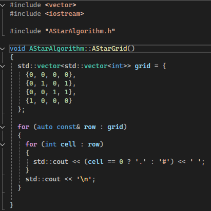
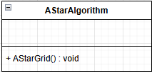
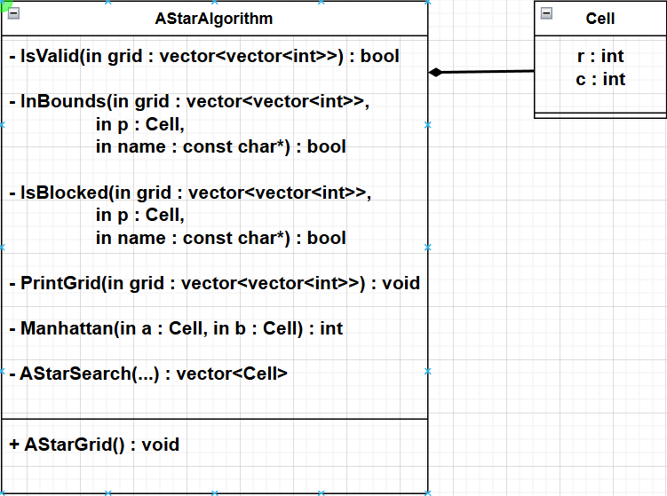

# AStarAlgorithm Project

The A Star Algorithm (A* Algorithm) is a pathfinding and graph traversal algorithm used to find the shortest path between a start node and a goal node. It is commonly used by Google Maps and in many tower defense games.

## Week 1

### Initial Research

To begin the project, I started by looking at the GeeksforGeeks link that Michelle linked on moodle.
- https://www.geeksforgeeks.org/dsa/a-search-algorithm/ 

This gave me some information on what the A* algorithm is and what it is used for. It outlined how the A* algorithm has 'brains' compared to other traversal techniques. There was also an explanation given which described in more technical detail how the A* algorithm works. Here is a summary of this: 

The A* Search Algorithm is used to find the shortest path between a starting cell and a target cell on a grid that may contain obstacles. At each step, A* selects the next cell based on a value called: 
- **`f = g + h`** 

Where:
- **`g`** is the actual cost from the starting cell to the current cell.
- **`h`** is the estimated cost from the current cell to the target (this estimate is called a heuristic). 

The algorithm always chooses the cell with the lowest **`f`** value. By combining the distance already travelled (**`g`**) with an estimate of the remaining distance (**`h`**), A* efficiently guides the search toward the goal while still guaranteeing the shortest path. 

In simple terms, A* works by choosing the path that appears shortest overall based on both actual progress and an intelligent estimate of what remains.

### Initial Code
To start coding, I created an OO (Object Oriented) C++ project which consisted of `main.cpp`, `AStarAlgorithm.cpp`, and `AStarAlgorithm.h`. I did this to follow the brief and to avoid using monolithic code and create a more modular project. In my header file, I included a header guard to avoid multiple `#include`s of my header file, which could cause redefinition errors. Including a header guard also just follows good modern C++ coding practices. 

In my header file, within my header guard, I created a class called `AStarAlgorithm`. I will use this class to hold `public` and `private` member functions. I will use `private` for data to ensure data protection. I created a `void AStarGrid();` function declaration and in my `AStarAlgorithm.cpp` file, I will have the function definition.

In `AStarAlgorithm.cpp`, I `#include "AStarAlgorithm.h"` to have access to the class and methods. In `AStarGrid`, I create a 2-d vector which creates a grid made up of `1`'s and `0`'s, `1` being a blocked node and `0` being an unblocked node. I use vectors as they are the preferred method for storing a range of elements. Vectors are preferred over arrays as vectors can be resized but both are preferred over C arrays to avoid memory bugs. As outlined in the `C++ Core Guidelines`, vectors should be used by default unless you have a reason to use a different container 
- **SL.con.1: Prefer using STL array or vector instead of a C array**
- **SL.con.2: Prefer using STL vector by default unless you have a reason to use a different container** 

I print out the grid with blocked nodes being represented by `#` and unblocked nodes being represented by `.` 

 

Then in my `main.cpp`, I create an object of class `AStarAlgorithm` and call the `AStarGrid` method to actually display it. In week 2, I will be looking at UML diagrams and how I can design my code before I start developing.

## Week 2
### Initial UML Diagram Research
In week 2, I focused on the design and structure of my A* Algorithm project using UML Class Diagrams. UML class diagrams are used to show the structure of a system. It shows classes, attributes, methods, and relationships. This makes it easier to communicate how the program works. To understand the layout of UML class diagrams, I looked at GeeksforGeeks and visual paradigm:
- https://www.geeksforgeeks.org/system-design/unified-modeling-language-uml-class-diagrams/
- https://www.visual-paradigm.com/guide/uml-unified-modeling-language/uml-aggregation-vs-composition/ 

This explained that a class diagram typically shows:
- a class as a rectangle with name/attribute/method compartments.
- the relationship between classes 

There are also certain notations that are used to represent the access level attributes and methods
- `+` for public (visible to all classes)
- `-` for private (visible only within the class)
- `#` for protected (visible to subclasses)
- `~` for package or default visibility (visible to classes in the same package) 

The main notations I will use are `+` and `-`.

### Initial UML Class Diagram

This was the initial UML class diagram I had for my week 1 code. It is obvious from the image that I needed to spend some time developing my project design. I want to have methods that check the validity of my grid, check if a cell is in bounds, and checks if a cell is blocked. I will add them as private methods. I also want a variable that will hold the current coordinates of the cell the algorithm is in. I will use a struct for this to hold the row and column coordinates. An example use of a struct on C.2 C++ Core guidelines shows it being used when members can vary independently.
- **C.2: Use class if the class has an invariant; use struct if the data members can vary independently** 

I also know I will want a method to use the manhattan distance calculation. This is a heuristic calculation used to approximate `h`. It is described as:

>the sum of absolute values of differences in the goal’s x and y coordinates and the current cell’s x and y coordinates respectively

on the GeeksfoGeeks reference <a href="https://www.geeksforgeeks.org/dsa/a-search-algorithm/#:~:text=the%20sum%20of%20absolute%20values%20of%20differences%20in%20the%20goal%E2%80%99s%20x%20and%20y%20coordinates%20and%20the%20current%20cell%E2%80%99s%20x%20and%20y%20coordinates%20respectively">here.</a> 

I also want a method that will complete the actual A* algorithm search of the grid. This is where I will do my grid validation checking, run my manhattan calculation, and find the best path from start to goal. By the end of week 2, This is what my UML Class Diagram looks like

I'm sure this will develop over the weeks but it is a good starting point for now.

## Week 3
In week 3, I focused my work on creating grid and cell validation methods, the manhattan calculation, and creating the actual A* star search method which will do the actual calculation for finding the best route from start to goal

### Validation Methods
- talk about each validation method and what it checks
- talk about why they are used

### Initial Research and Understanding of Manhattan Calculation

- talk about image above and explain manhattan a bit and f, g, and h
- talk about A* Search method 
- talk about what was good and bad about the code from AI

### A* Search Method
- explain overview of method
- explain key points of method, what they do

## Week 4

## Week 5

## Week 6
