# AStarAlgorithm Project

The A Star Algorithm (A* Algorithm) is a pathfinding and graph traversal algorithm used to find the shortest path between a start node and a goal node. It is commonly used by Google Maps and in many tower defense games.

## Week 1

### Initial Research

To begin the project, I started by looking at the GeeksforGeeks link that Michelle linked on moodle.
- https://www.geeksforgeeks.org/dsa/a-search-algorithm/<br>

This gave me some information on what the A* algorithm is and what it is used for. It outlined how the A* algorithm has 'brains' compared to other traversal techniques. There was also an explanation given which described in more technical detail how the A* algorithm works. Here is a summary of this:<br>

The A* Search Algorithm is used to find the shortest path between a starting cell and a target cell on a grid that may contain obstacles. At each step, A* selects the next cell based on a value called: 
- **`f = g + h`**<br>

Where:
- **`g`** is the actual cost from the starting cell to the current cell.
- **`h`** is the estimated cost from the current cell to the target (this estimate is called a heuristic).<br>

The algorithm always chooses the cell with the lowest **`f`** value. By combining the distance already travelled (**`g`**) with an estimate of the remaining distance (**`h`**), A* efficiently guides the search toward the goal while still guaranteeing the shortest path.<br>

In simple terms, A* works by choosing the path that appears shortest overall based on both actual progress and an intelligent estimate of what remains.

### Initial Code
To start coding, I created an OO (Object Oriented) C++ project which consisted of `main.cpp`, `AStarAlgorithm.cpp`, and `AStarAlgorithm.h`. I did this to follow the brief and to avoid using monolithic code and create a more modular project. In my header file, I included a header guard to avoid multiple `#include`s of my header file, which could cause redefinition errors. Including a header guard also just follows good modern C++ coding practices.<br>

In my header file, within my header guard, I created a class called `AStarAlgorithm`. I will use this class to hold `public` and `private` member functions. I will use `private` for data to ensure data protection. I created a `void AStarGrid();` function declaration and in my `AStarAlgorithm.cpp` file, I will have the function definition.

<p align="center">
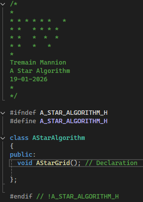
</p>

In `AStarAlgorithm.cpp`, I `#include "AStarAlgorithm.h"` to have access to the class and methods. In `AStarGrid`, I create a 2-d vector which creates a grid made up of `1`'s and `0`'s, `1` being a blocked node and `0` being an unblocked node. I use vectors as they are the preferred method for storing a range of elements. Vectors are preferred over arrays as vectors can be resized but both are preferred over C arrays to avoid memory bugs. As outlined in the `C++ Core Guidelines`, vectors should be used by default unless you have a reason to use a different container<br>
- **SL.con.1: Prefer using STL array or vector instead of a C array**
- **SL.con.2: Prefer using STL vector by default unless you have a reason to use a different container**<br>

I print out the grid with blocked nodes being represented by `#` and unblocked nodes being represented by `.`<br>

<p align="center">
 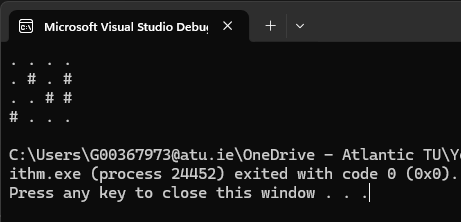
</p>

Then in my `main.cpp`, I create an object of class `AStarAlgorithm` and call the `AStarGrid` method to actually display it. In week 2, I will be looking at UML diagrams and how I can design my code before I start developing.

---

## Week 2
### Initial UML Diagram Research
In week 2, I focused on the design and structure of my A* Algorithm project using UML Class Diagrams. UML class diagrams are used to show the structure of a system. It shows classes, attributes, methods, and relationships. This makes it easier to communicate how the program works. To understand the layout of UML class diagrams, I looked at GeeksforGeeks and visual paradigm:
- https://www.geeksforgeeks.org/system-design/unified-modeling-language-uml-class-diagrams/
- https://www.visual-paradigm.com/guide/uml-unified-modeling-language/uml-aggregation-vs-composition/<br>

This explained that a class diagram typically shows:
- a class as a rectangle with name/attribute/method compartments.
- the relationship between classes<br>

There are also certain notations that are used to represent the access level attributes and methods
- `+` for public (visible to all classes)
- `-` for private (visible only within the class)
- `#` for protected (visible to subclasses)
- `~` for package or default visibility (visible to classes in the same package)<br>

The main notations I will use are `+` and `-`.

### Initial UML Class Diagram
<p align="center">

</p>

This was the initial UML class diagram I had for my week 1 code. It is obvious from the image that I needed to spend some time developing my project design. I want to have methods that check the validity of my grid, check if a cell is in bounds, and checks if a cell is blocked. I will add them as private methods. I also want a variable that will hold the current coordinates of the cell the algorithm is in. I will use a struct for this to hold the row and column coordinates. An example use of a struct on C.2 C++ Core guidelines shows it being used when members can vary independently.
- **C.2: Use class if the class has an invariant; use struct if the data members can vary independently**<br>

<p align="center">

</p>

I also know I will want a method to use the manhattan distance calculation. This is a heuristic calculation used to approximate `h`. It is described as:

>the sum of absolute values of differences in the goal’s x and y coordinates and the current cell’s x and y coordinates respectively

on the GeeksfoGeeks reference <a href="https://www.geeksforgeeks.org/dsa/a-search-algorithm/#:~:text=the%20sum%20of%20absolute%20values%20of%20differences%20in%20the%20goal%E2%80%99s%20x%20and%20y%20coordinates%20and%20the%20current%20cell%E2%80%99s%20x%20and%20y%20coordinates%20respectively">here.</a><br>

I also want a method that will complete the actual A* algorithm search of the grid. This is where I will do my grid validation checking, run my manhattan calculation, and find the best path from start to goal. By the end of week 2, This is what my UML Class Diagram looks like
<p align="center">
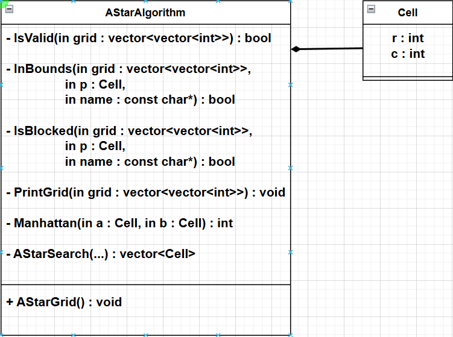
</p>

I'm sure this will develop over the weeks but it is a good starting point for now.

---

## Week 3
In week 3, I focused my work on creating grid and cell validation methods, the manhattan calculation, and creating the actual A* star search method which will do the actual calculation for finding the best route from start to goal

### Validation Methods
Before running A*, I added a small set of validation methods to make sure the grid and inputs are valid. This prevents crashes (like out-of-range indexing) and avoids wasting time running the algorithm on impossible setups.

<p align="center">

</p>

**What it checks**<br>
The grid contains data:
- `grid` is not empty (has rows)
- `grid[0]` is not empty (has columns)

**Why it's used**<br>
A* relies on accessing `grid[0]` and `grid[r][c]`. If the grid is empty, those accesses would crash. It’s an early “sanity check” before doing anything else.

<p align="center">
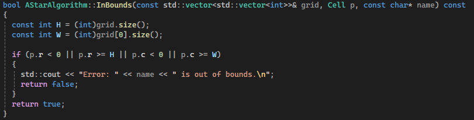
</p>

**What it checks**<br>
The Cell coordinator `p` is inside the grid:
- `0 <= p.r < grid.size()`
- `0 <= p.c < grid[0].size()`

**Why it’s used**<br>
It prevents out-of-bounds indexing when reading `grid[p.r][p.c]` and ensures the start/goal (and any checked positions) are valid locations on the grid. The `name` parameter (“Start”, “Goal”) makes error messages clearer.

<p align="center">

</p>

**What it checks**<br>
If the cell at `p` is walkable.
- `grid[p.r][p.c] == 0` (cell is free).
- if it’s `1` (blocked), the method returns false.

**Why it's used**
- Stops A* running if the start or goal is on a wall.
- Makes the program more user-friendly (clear error instead of confusing results).

#### Why validation matters
- **Safety**: avoids crashes from invalid indexing.
- **Correctness**: ensures A* starts from a valid position and has a reachable target.
- **Cleaner algorithm code**: A* can assume inputs are valid and focus only on pathfinding logic.

### Initial Research and Understanding of Manhattan Calculation
<p align="center">
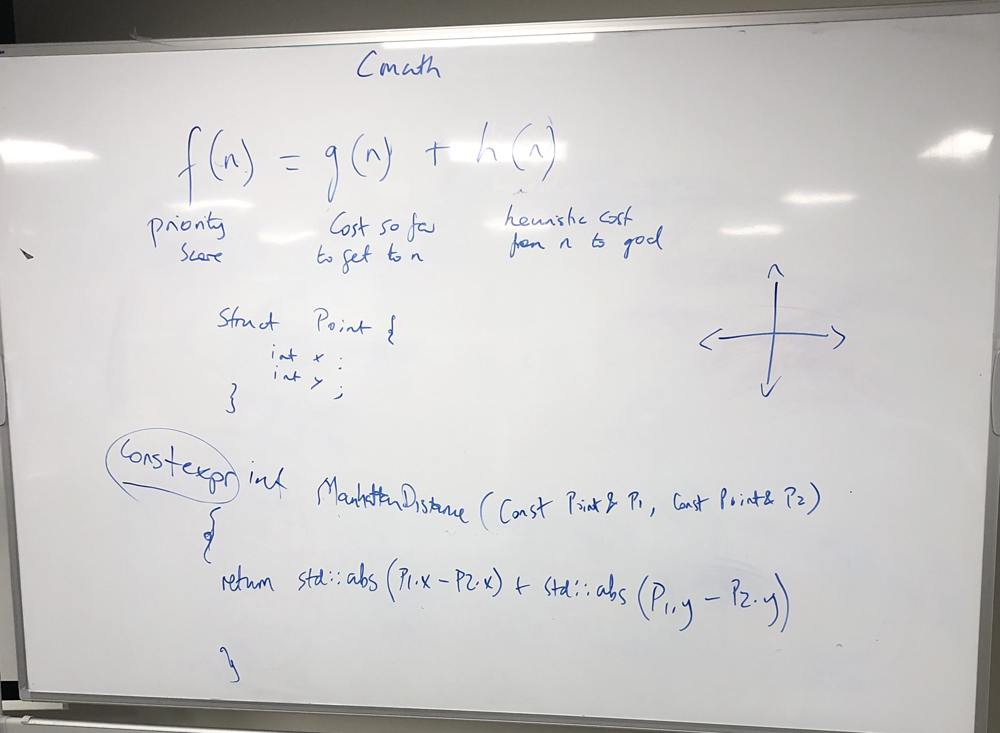
</p>

In my A* implementation, I use the **Manhattan distance** as the heuristic function h(n). The heuristic estimates how far a node is from the goal. The A* formula is **`f(n) = g(n) + h(n)`**
- **`g(n)`** = cost from start to current node
- **`h(n)`** = estimated cost from current node to goal
- **`f(n)`** = total estimated cost of the path

The Manhattan distance is what I use for **`h(n)`**.

### Manhattan Implementation
<p align="center">

</p>

The above method calculates the Manhattan distance between two points on a grid. If `a` is the current node and `b` is the goal node, Then the function returns the total number of horizontal and vertical steps required to move from `a` to `b`.
- **`std::abs(a.r - b.r)`** calculates the vertical distance (difference in rows).
- **`std::abs(a.c - b.c)`** calculates the horizontal distance (difference in columns).

They are added because, in a 4-direction grid, you can only move up, down, left, or right. You can’t move diagonally, so moving horizontally doesn’t reduce the vertical distance, and moving vertically doesn’t reduce the horizontal distance. To get to the goal, you have to complete all of the horizontal moves and all of the vertical moves. Since each move costs 1, the total distance is just the number of horizontal steps plus the number of vertical steps. The absolute value ensures the result is always positive. This is fine as we only care about the distance, not the direction.

### A\* Search Method

`AStarSearch()` is the method that actually runs the A\* pathfinding algorithm on my grid. It returns a path as a `std::vector<Cell>` from the start cell to the goal cell, or an empty vector if no path exists. Below I'll step through each section of the method and explain what it does and why it's there.

#### Step 1: Early Validation

<p align="center">
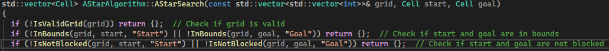
</p>

The first thing `AStarSearch()` does is run the three validation checks before any algorithm logic starts. If the grid is empty, if start/goal are outside the grid, or if start/goal are walls, the method returns an empty vector immediately. This keeps A\* focused purely on searching — it should never have to guard against invalid data mid-loop.

#### Step 2: Grid Size and Flattening Setup

<p align="center">
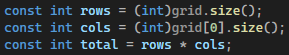
</p>

Here I read the grid dimensions and calculate the total number of cells. The reason I store `total` is that all of the A\* state arrays (`bestG`, `parent`, `closed`) are 1D vectors of size `total`. Working with 1D arrays is simpler and more cache-friendly than nested 2D structures.

#### Step 3: Two Lambdas: Mapping 2D to 1D

```cpp
auto toIndex = [cols](const Cell& p) { return p.r * cols + p.c; };
auto toCell  = [cols](int idx)       { return Cell{ idx / cols, idx % cols }; };
```

These two lambdas convert between a 2D cell coordinate and a flat 1D index. `toIndex` turns `(r, c)` into a single integer, and `toCell` turns it back. For example on a 4-column grid: `(2, 3)` becomes `2 * 4 + 3 = 11`, and `11` maps back to `(11 / 4, 11 % 4) = (2, 3)`. This means I can use simple array indexing like `bestG[idx]` everywhere rather than `bestG[r][c]`, which keeps the code cleaner and the data contiguous in memory.

**Start and Goals Indices**
<p align="center">
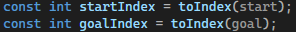
</p>

Here we are using the lambdas to convert start and goal to the flattened index form so the algorithm can use them for arrays and queue items.

#### Step 4: Core A\* Data Structures

<p align="center">
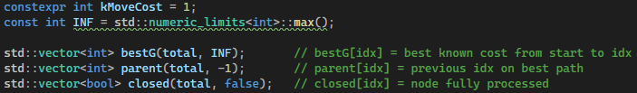
</p>

These three vectors are the core state of the algorithm:

* **`bestG`** stores the best (lowest) known cost to reach each node from the start. It starts as `INF` (meaning unreached) and gets updated whenever a shorter path is found
* **`parent`** stores the index of the previous node on the best known path to each node. It starts as `-1` (no parent) and is used at the end to reconstruct the path by walking backwards
* **`closed`** tracks which nodes have been fully processed and expanded. Once a node is closed, we know we already have the optimal cost to reach it and don't need to revisit it

#### Step 5: The Open Node and Priority Queue

<p align="center">

</p>

`OpenNode` is what gets stored in the priority queue. It holds the total estimated cost `f = g + h`, the actual cost so far `g`, and the flattened cell index. The comparator `CompareBySmallestF` makes `std::priority_queue` behave as a **min-heap** by returning `a.f > b.f`. This means the node with the lowest `f` is always at the top and is popped first, which is exactly what A\* requires.

#### Step 6: Initialising the Search

<p align="center">
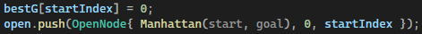
</p>

The search starts by setting the start node's `g` cost to `0` and pushing it into the open queue with `f = 0 + h = Manhattan(start, goal)`. This is the only node we know anything about at the start, so it's the first candidate to be expanded.

#### Step 7: 4-Direction Movement Vectors

<p align="center">

</p>

These two arrays represent the four directions: up, down, left, right. By looping `k` from 0 to 3 and applying `dr[k]` and `dc[k]` to the current cell, I generate all four neighbours cleanly without repeating code four times.

#### Step 8: Path Reconstruction Lambda

<p align="center">
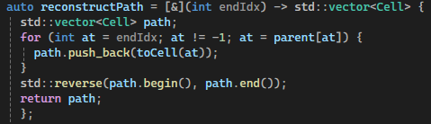
</p>

A\* doesn't store the full path while it searches, it only stores "where I came from" at each node. When the goal is reached, this lambda walks backwards through the `parent` array from goal to start, building up a vector of cells, then reverses it to get the correct start to goal order. This is memory-efficient because we don't maintain a growing path list throughout the search.

#### Step 9: The Main Loop

<p align="center">
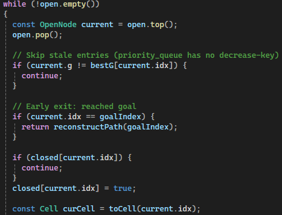
</p>

The main `while` loop runs as long as there are nodes to explore. On each iteration it pops the node with the lowest `f` value from the priority queue.

**Skipping stale entries:**

```cpp
if (current.g != bestG[current.idx]) { continue; }
```

Because `std::priority_queue` has no way to update the priority of an existing entry (no "decrease-key" operation), when a better path to a node is found I push a new, improved entry and leave the old one in the queue. This check detects those old entries if the `g` value on the popped node doesn't match the best known `g` for that cell, it's a stale duplicate and gets skipped.

**Early exit on reaching the goal:**

```cpp
if (current.idx == goalIndex) {
    return reconstructPath(goalIndex);
}
```

As soon as the goal node is popped from the queue, the path found is guaranteed to be optimal with an admissible heuristic like Manhattan distance, the first time you pop a node its cost is the shortest. So we immediately reconstruct and return the path.

**Closed set check:**

```cpp
if (closed[current.idx]) { continue; }
closed[current.idx] = true;
```

If the node has already been fully expanded, skip it. Otherwise mark it as closed so it won't be expanded again.

#### Step 10: Expanding Neighbours

<p align="center">

</p>

For each of the four neighbours of the current cell, the algorithm applies a series of filters before considering it:

1. **Bounds check**: silently skip any cell outside the grid boundaries. This is done inline rather than calling `InBounds()` to avoid printing an error message for every out-of-bounds neighbour during the search loop
2. **Wall check**: skip cells where `grid[r][c] != 0`
3. **Closed check**: skip cells that are already fully processed

If the neighbour passes all three, the algorithm computes the **tentative g-cost**:

```cpp
const int tentativeG = bestG[current.idx] + kMoveCost;
if (tentativeG >= bestG[nIdx]) { continue; }
```

This is the "relaxation" step, the same idea used in Dijkstra's algorithm. If going through the current node would cost *at least* as much as the best route already known to reach the neighbour, there's no point updating anything. But if it's an improvement:

```cpp
parent[nIdx] = current.idx;
bestG[nIdx]  = tentativeG;
const int f  = tentativeG + Manhattan(neighbour, goal);
open.push(OpenNode{ f, tentativeG, nIdx });
```

The parent is updated, the best g-cost is updated, and the neighbour is pushed into the open queue with its new `f` value.

#### Step 11: No Path Found
```cpp
return {}; // no path
```

If the queue empties without ever reaching the goal, it means no valid path exists between the start and goal on this grid. The method returns an empty vector, which `AStarGrid()` then handles by printing "No path found."

### Why This Approach Is Good But Bad Coding Practice

The `AStarSearch()` method above works correctly. It finds the optimal path, handles edge cases, and produces the right output. Getting a working implementation of A\* is genuinely non-trivial, and having it all in one place makes it easy to read through from top to bottom and understand the full flow. For a first working version, this approach is perfectly reasonable.

However, from a software engineering standpoint, cramming validation, data structure definitions, helper lambdas, and the algorithm all into a single method is a poor coding practice. Below are the main issues with this approach, referenced against the C++ Core Guidelines and C++23 standards.

#### 1. It Violates the Single Responsibility Principle

The method does too many things: it validates inputs, defines types (`OpenNode`, `CompareBySmallestF`), defines helper functions (`toIndex`, `toCell`, `reconstructPath`), and runs the algorithm. The **C++ Core Guidelines** are clear on this:

> **C.2: Use class if the class has an invariant; use struct if the data members can vary independently**

More broadly, each unit of code should have **one reason to change**. If I need to change how the path is printed, I should not have to open the same file as the algorithm. If I want to test validation in isolation, I cannot. It is buried inside `AStarSearch()`.

#### 2. Local `struct` Definitions Hide Reusable Types

`OpenNode` and `CompareBySmallestF` are defined as local structs inside the function body:

```cpp
struct OpenNode { int f; int g; int idx; };
struct CompareBySmallestF { ... };
```

This means they are invisible outside of `AStarSearch()`. If I wanted to write a unit test for the priority queue ordering, or reuse `OpenNode` in a different search variant, I could not. Types that carry meaningful responsibility should be at an appropriate scope, at minimum class scope, and ideally in their own header if they are genuinely reusable. This follows:

> **I.1: Make interfaces explicit**: types used at the boundary of a function should be visible to callers

#### 3. `const char*` Instead of `std::string_view`

The validation methods use `const char*` for the `name` parameter:

```cpp
bool InBounds(const std::vector<std::vector>& grid, Cell p, const char* name) const;
```

C++17 introduced `std::string_view` as the correct way to pass read-only string data. It accepts string literals, `std::string`, and other string types without copying, and carries length information (unlike a raw pointer). Using `const char*` is a C-style habit that C++ has had a better answer for since 2017:

> **SL.str.2: Use `std::string_view` or `gsl::string_span` to refer to character sequences**

#### 4. The Repeated Complex Type `std::vector<std::vector<int>>`

The raw type `std::vector<std::vector<int>>` is written out in full in every function signature:

```cpp
std::vector AStarSearch(const std::vector<std::vector>& grid, Cell start, Cell goal);
bool IsValidGrid(const std::vector<std::vector>& grid) const;
bool InBounds(const std::vector<std::vector>& grid, Cell p, const char* name) const;
```

This is noisy, hard to read, and fragile. If the grid representation ever changes, every single signature needs to be updated manually. A type alias solves this immediately:

```cpp
using Grid = std::vector<std::vector>;
```

This follows:

> **T.1: Use aliases to express semantic intent and avoid repeating complex types**

All of these issues are exactly what motivated the refactor in week 4. Getting the algorithm working first was the right move,  but once it worked, taking the time to improve the structure made the code genuinely better: easier to test, easier to extend, and much more closely aligned with what modern C++ should look like.

---

## Week 4

## Week 5

## Week 6
