# AStarAlgorithm Project

The A Star Algorithm (A* Algorithm) is a pathfinding and graph traversal algorithm used to find the shortest path between a start node and a goal node. It is commonly used by Google Maps and in many tower defense games.

## Week 1

### Initial Research

To begin the project, I started by looking at the GeeksforGeeks link that Michelle linked on moodle.
- https://www.geeksforgeeks.org/dsa/a-search-algorithm/<br>

This gave me some information on what the A* algorithm is and what it is used for. It outlined how the A* algorithm has 'brains' compared to other traversal techniques. There was also an explanation given which described in more technical detail how the A* algorithm works. Here is a summary of this:<br>

The A* Search Algorithm is used to find the shortest path between a starting cell and a target cell on a grid that may contain obstacles. At each step, A* selects the next cell based on a value called: 
- **`f = g + h`**<br>

Where:
- **`g`** is the actual cost from the starting cell to the current cell.
- **`h`** is the estimated cost from the current cell to the target (this estimate is called a heuristic).<br>

The algorithm always chooses the cell with the lowest **`f`** value. By combining the distance already travelled (**`g`**) with an estimate of the remaining distance (**`h`**), A* efficiently guides the search toward the goal while still guaranteeing the shortest path.<br>

In simple terms, A* works by choosing the path that appears shortest overall based on both actual progress and an intelligent estimate of what remains.

### Initial Code
To start coding, I created an OO (Object Oriented) C++ project which consisted of `main.cpp`, `AStarAlgorithm.cpp`, and `AStarAlgorithm.h`. I did this to follow the brief and to avoid using monolithic code and create a more modular project. In my header file, I included a header guard to avoid multiple `#include`s of my header file, which could cause redefinition errors. Including a header guard also just follows good modern C++ coding practices.<br>

In my header file, within my header guard, I created a class called `AStarAlgorithm`. I will use this class to hold `public` and `private` member functions. I will use `private` for data to ensure data protection. I created a `void AStarGrid();` function declaration and in my `AStarAlgorithm.cpp` file, I will have the function definition.

<p align="center">

</p>

In `AStarAlgorithm.cpp`, I `#include "AStarAlgorithm.h"` to have access to the class and methods. In `AStarGrid`, I create a 2-d vector which creates a grid made up of `1`'s and `0`'s, `1` being a blocked node and `0` being an unblocked node. I use vectors as they are the preferred method for storing a range of elements. Vectors are preferred over arrays as vectors can be resized but both are preferred over C arrays to avoid memory bugs. As outlined in the `C++ Core Guidelines`, vectors should be used by default unless you have a reason to use a different container<br>
> SL.con.1: Prefer using STL array or vector instead of a C array

> SL.con.2: Prefer using STL vector by default unless you have a reason to use a different container

I print out the grid with blocked nodes being represented by `#` and unblocked nodes being represented by `.`<br>

<p align="center">
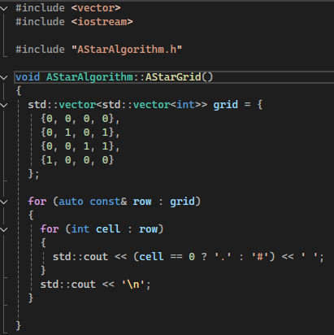 
</p>

Then in my `main.cpp`, I create an object of class `AStarAlgorithm` and call the `AStarGrid` method to actually display it. In week 2, I will be looking at UML diagrams and how I can design my code before I start developing.

---

## Week 2
### Initial UML Diagram Research
In week 2, I focused on the design and structure of my A* Algorithm project using UML Class Diagrams. UML class diagrams are used to show the structure of a system. It shows classes, attributes, methods, and relationships. This makes it easier to communicate how the program works. To understand the layout of UML class diagrams, I looked at GeeksforGeeks and visual paradigm:
- https://www.geeksforgeeks.org/system-design/unified-modeling-language-uml-class-diagrams/
- https://www.visual-paradigm.com/guide/uml-unified-modeling-language/uml-aggregation-vs-composition/<br>

This explained that a class diagram typically shows:
- a class as a rectangle with name/attribute/method compartments.
- the relationship between classes<br>

There are also certain notations that are used to represent the access level attributes and methods
- `+` for public (visible to all classes)
- `-` for private (visible only within the class)
- `#` for protected (visible to subclasses)
- `~` for package or default visibility (visible to classes in the same package)<br>

The main notations I will use are `+` and `-`.

### Initial UML Class Diagram
<p align="center">
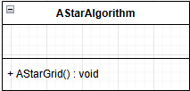
</p>

This was the initial UML class diagram I had for my week 1 code. It is obvious from the image that I needed to spend some time developing my project design. I want to have methods that check the validity of my grid, check if a cell is in bounds, and checks if a cell is blocked. I will add them as private methods. I also want a variable that will hold the current coordinates of the cell the algorithm is in. I will use a struct for this to hold the row and column coordinates. An example use of a struct on C.2 C++ Core guidelines shows it being used when members can vary independently.
- **C.2: Use class if the class has an invariant; use struct if the data members can vary independently**<br>

<p align="center">
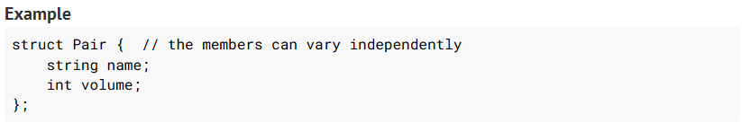
</p>

I also know I will want a method to use the manhattan distance calculation. This is a heuristic calculation used to approximate `h`. It is described as:

>the sum of absolute values of differences in the goal’s x and y coordinates and the current cell’s x and y coordinates respectively

on the GeeksfoGeeks reference <a href="https://www.geeksforgeeks.org/dsa/a-search-algorithm/#:~:text=the%20sum%20of%20absolute%20values%20of%20differences%20in%20the%20goal%E2%80%99s%20x%20and%20y%20coordinates%20and%20the%20current%20cell%E2%80%99s%20x%20and%20y%20coordinates%20respectively">here.</a><br>

I also want a method that will complete the actual A* algorithm search of the grid. This is where I will do my grid validation checking, run my manhattan calculation, and find the best path from start to goal. By the end of week 2, This is what my UML Class Diagram looks like
<p align="center">

</p>

I'm sure this will develop over the weeks but it is a good starting point for now.

---

## Week 3
In week 3, I focused my work on creating grid and cell validation methods, the manhattan calculation, and creating the actual A* star search method which will do the actual calculation for finding the best route from start to goal

### Validation Methods
Before running A*, I added a small set of validation methods to make sure the grid and inputs are valid. This prevents crashes (like out-of-range indexing) and avoids wasting time running the algorithm on impossible setups.

#### IsValid

<p align="center">
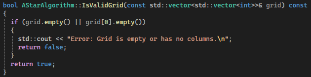
</p>

**What it checks**<br>
The grid contains data:
- `grid` is not empty (has rows)
- `grid[0]` is not empty (has columns)

**Why it's used**<br>
A* relies on accessing `grid[0]` and `grid[r][c]`. If the grid is empty, those accesses would crash. It’s an early “sanity check” before doing anything else.

#### InBounds

<p align="center">

</p>

**What it checks**<br>
The Cell coordinator `p` is inside the grid:
- `0 <= p.r < grid.size()`
- `0 <= p.c < grid[0].size()`

**Why it’s used**<br>
It prevents out-of-bounds indexing when reading `grid[p.r][p.c]` and ensures the start/goal (and any checked positions) are valid locations on the grid. The `name` parameter (“Start”, “Goal”) makes error messages clearer.

#### IsNotBlocked

<p align="center">
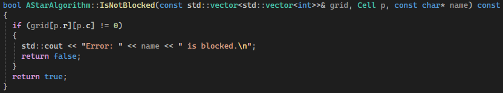
</p>

**What it checks**<br>
If the cell at `p` is walkable.
- `grid[p.r][p.c] == 0` (cell is free).
- if it’s `1` (blocked), the method returns false.

**Why it's used**
- Stops A* running if the start or goal is on a wall.
- Makes the program more user-friendly (clear error instead of confusing results).

#### Why validation matters
- **Safety**: avoids crashes from invalid indexing.
- **Correctness**: ensures A* starts from a valid position and has a reachable target.
- **Cleaner algorithm code**: A* can assume inputs are valid and focus only on pathfinding logic.

### Initial Research and Understanding of Manhattan Calculation
<p align="center">

</p>

In my A* implementation, I use the **Manhattan distance** as the heuristic function h(n). The heuristic estimates how far a node is from the goal. The A* formula is **`f(n) = g(n) + h(n)`**
- **`g(n)`** = cost from start to current node
- **`h(n)`** = estimated cost from current node to goal
- **`f(n)`** = total estimated cost of the path

The Manhattan distance is what I use for **`h(n)`**.

### Manhattan Implementation
<p align="center">
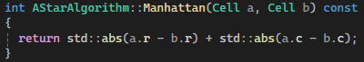
</p>

The above method calculates the Manhattan distance between two points on a grid. If `a` is the current node and `b` is the goal node, Then the function returns the total number of horizontal and vertical steps required to move from `a` to `b`.
- **`std::abs(a.r - b.r)`** calculates the vertical distance (difference in rows).
- **`std::abs(a.c - b.c)`** calculates the horizontal distance (difference in columns).

They are added because, in a 4-direction grid, you can only move up, down, left, or right. You can’t move diagonally, so moving horizontally doesn’t reduce the vertical distance, and moving vertically doesn’t reduce the horizontal distance. To get to the goal, you have to complete all of the horizontal moves and all of the vertical moves. Since each move costs 1, the total distance is just the number of horizontal steps plus the number of vertical steps. The absolute value ensures the result is always positive. This is fine as we only care about the distance, not the direction.

### A\* Search Method

`AStarSearch()` is the method that actually runs the A\* pathfinding algorithm on my grid. It returns a path as a `std::vector<Cell>` from the start cell to the goal cell, or an empty vector if no path exists. Below I'll step through each section of the method and explain what it does and why it's there.

#### Step 1: Early Validation

<p align="center">

</p>

The first thing `AStarSearch()` does is run the three validation checks before any algorithm logic starts. If the grid is empty, if start/goal are outside the grid, or if start/goal are walls, the method returns an empty vector immediately. This keeps A\* focused purely on searching — it should never have to guard against invalid data mid-loop.

#### Step 2: Grid Size and Flattening Setup

<p align="center">

</p>

Here I read the grid dimensions and calculate the total number of cells. The reason I store `total` is that all of the A\* state arrays (`bestG`, `parent`, `closed`) are 1D vectors of size `total`. Working with 1D arrays is simpler and more cache-friendly than nested 2D structures. This was a nice addition from Claude.

#### Step 3: Two Lambdas: Mapping 2D to 1D

```cpp
auto toIndex = [cols](const Cell& p) { return p.r * cols + p.c; };
auto toCell  = [cols](int idx)       { return Cell{ idx / cols, idx % cols }; };
```

These two lambdas convert between a 2D cell coordinate and a flat 1D index. `toIndex` turns `(r, c)` into a single integer, and `toCell` turns it back. For example on a 4-column grid: `(2, 3)` becomes `2 * 4 + 3 = 11`, and `11` maps back to `(11 / 4, 11 % 4) = (2, 3)`. This means I can use simple array indexing like `bestG[idx]` everywhere rather than `bestG[r][c]`, which keeps the code cleaner and the data contiguous in memory.

**Start and Goals Indices**
<p align="center">

</p>

Here we are using the lambdas to convert start and goal to the flattened index form so the algorithm can use them for arrays and queue items.

#### Step 4: Core A\* Data Structures

<p align="center">

</p>

These three vectors are the core state of the algorithm:

* **`bestG`** stores the best (lowest) known cost to reach each node from the start. It starts as `INF` (meaning unreached) and gets updated whenever a shorter path is found
* **`parent`** stores the index of the previous node on the best known path to each node. It starts as `-1` (no parent) and is used at the end to reconstruct the path by walking backwards
* **`closed`** tracks which nodes have been fully processed and expanded. Once a node is closed, we know we already have the optimal cost to reach it and don't need to revisit it

#### Step 5: The Open Node and Priority Queue

<p align="center">
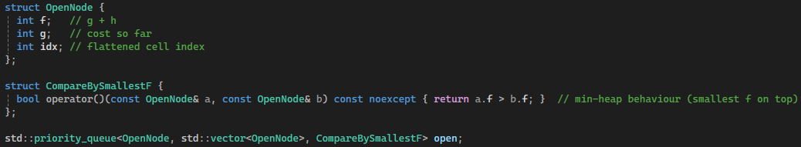
</p>

`OpenNode` is what gets stored in the priority queue. It holds the total estimated cost `f = g + h`, the actual cost so far `g`, and the flattened cell index. The comparator `CompareBySmallestF` makes `std::priority_queue` behave as a **min-heap** by returning `a.f > b.f`. This means the node with the lowest `f` is always at the top and is popped first, which is exactly what A\* requires.

#### Step 6: Initialising the Search

<p align="center">

</p>

The search starts by setting the start node's `g` cost to `0` and pushing it into the open queue with `f = 0 + h = Manhattan(start, goal)`. This is the only node we know anything about at the start, so it's the first candidate to be expanded.

#### Step 7: 4-Direction Movement Vectors

<p align="center">
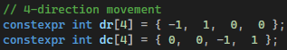
</p>

These two arrays represent the four directions: up, down, left, right. By looping `k` from 0 to 3 and applying `dr[k]` and `dc[k]` to the current cell, I generate all four neighbours cleanly without repeating code four times.

#### Step 8: Path Reconstruction Lambda

<p align="center">

</p>

A\* doesn't store the full path while it searches, it only stores "where I came from" at each node. When the goal is reached, this lambda walks backwards through the `parent` array from goal to start, building up a vector of cells, then reverses it to get the correct start to goal order. This is memory-efficient because we don't maintain a growing path list throughout the search.

#### Step 9: The Main Loop

<p align="center">

</p>

The main `while` loop runs as long as there are nodes to explore. On each iteration it pops the node with the lowest `f` value from the priority queue.

**Skipping stale entries:**

```cpp
if (current.g != bestG[current.idx]) { continue; }
```

Because `std::priority_queue` has no way to update the priority of an existing entry (no "decrease-key" operation), when a better path to a node is found I push a new, improved entry and leave the old one in the queue. This check detects those old entries if the `g` value on the popped node doesn't match the best known `g` for that cell, it's a stale duplicate and gets skipped.

**Early exit on reaching the goal:**

```cpp
if (current.idx == goalIndex) {
    return reconstructPath(goalIndex);
}
```

As soon as the goal node is popped from the queue, the path found is guaranteed to be optimal with an admissible heuristic like Manhattan distance, the first time you pop a node its cost is the shortest. So we immediately reconstruct and return the path.

**Closed set check:**

```cpp
if (closed[current.idx]) { continue; }
closed[current.idx] = true;
```

If the node has already been fully expanded, skip it. Otherwise mark it as closed so it won't be expanded again.

#### Step 10: Expanding Neighbours

<p align="center">
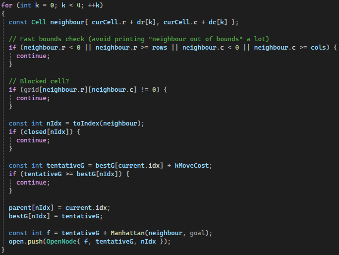
</p>

For each of the four neighbours of the current cell, the algorithm applies a series of filters before considering it:

1. **Bounds check**: silently skip any cell outside the grid boundaries. This is done inline rather than calling `InBounds()` to avoid printing an error message for every out-of-bounds neighbour during the search loop
2. **Wall check**: skip cells where `grid[r][c] != 0`
3. **Closed check**: skip cells that are already fully processed

If the neighbour passes all three, the algorithm computes the **tentative g-cost**:

```cpp
const int tentativeG = bestG[current.idx] + kMoveCost;
if (tentativeG >= bestG[nIdx]) { continue; }
```

This is the "relaxation" step, the same idea used in Dijkstra's algorithm. If going through the current node would cost *at least* as much as the best route already known to reach the neighbour, there's no point updating anything. But if it's an improvement:

```cpp
parent[nIdx] = current.idx;
bestG[nIdx]  = tentativeG;
const int f  = tentativeG + Manhattan(neighbour, goal);
open.push(OpenNode{ f, tentativeG, nIdx });
```

The parent is updated, the best g-cost is updated, and the neighbour is pushed into the open queue with its new `f` value.

#### Step 11: No Path Found
```cpp
return {}; // no path
```

If the queue empties without ever reaching the goal, it means no valid path exists between the start and goal on this grid. The method returns an empty vector, which `AStarGrid()` then handles by printing "No path found."

### Why This Approach Is Good But Bad Coding Practice

The `AStarSearch()` method above works correctly. It finds the optimal path, handles edge cases, and produces the right output. Getting a working implementation of A\* is genuinely non-trivial, and having it all in one place makes it easy to read through from top to bottom and understand the full flow. For a first working version, this approach is perfectly reasonable.

However, from a software engineering standpoint, cramming validation, data structure definitions, helper lambdas, and the algorithm all into a single method is a poor coding practice. Below are the main issues with this approach, referenced against the C++ Core Guidelines and C++23 standards.

#### 1. It Violates the Single Responsibility Principle

The method does too many things: it validates inputs, defines types (`OpenNode`, `CompareBySmallestF`), defines helper functions (`toIndex`, `toCell`, `reconstructPath`), and runs the algorithm. The **C++ Core Guidelines** are clear on this:

> **C.2: Use class if the class has an invariant; use struct if the data members can vary independently**

More broadly, each unit of code should have **one reason to change**. If I need to change how the path is printed, I should not have to open the same file as the algorithm. If I want to test validation in isolation, I cannot. It is buried inside `AStarSearch()`.

#### 2. Local `struct` Definitions Hide Reusable Types

`OpenNode` and `CompareBySmallestF` are defined as local structs inside the function body:

```cpp
struct OpenNode { int f; int g; int idx; };
struct CompareBySmallestF { ... };
```

This means they are invisible outside of `AStarSearch()`. If I wanted to write a unit test for the priority queue ordering, or reuse `OpenNode` in a different search variant, I could not. Types that carry meaningful responsibility should be at an appropriate scope, at minimum class scope, and ideally in their own header if they are genuinely reusable. This follows:

> **I.1: Make interfaces explicit**: types used at the boundary of a function should be visible to callers

#### 3. `const char*` Instead of `std::string_view`

The validation methods use `const char*` for the `name` parameter:

```cpp
bool InBounds(const std::vector<std::vector>& grid, Cell p, const char* name) const;
```

C++17 introduced `std::string_view` as the correct way to pass read-only string data. It accepts string literals, `std::string`, and other string types without copying, and carries length information (unlike a raw pointer). Using `const char*` is a C-style habit that C++ has had a better answer for since 2017:

> **SL.str.2: Use `std::string_view` or `gsl::string_span` to refer to character sequences**

#### 4. The Repeated Complex Type `std::vector<std::vector<int>>`

The raw type `std::vector<std::vector<int>>` is written out in full in every function signature:

```cpp
std::vector AStarSearch(const std::vector<std::vector>& grid, Cell start, Cell goal);
bool IsValidGrid(const std::vector<std::vector>& grid) const;
bool InBounds(const std::vector<std::vector>& grid, Cell p, const char* name) const;
```

This is noisy, hard to read, and fragile. If the grid representation ever changes, every single signature needs to be updated manually. A type alias solves this immediately:

```cpp
using Grid = std::vector<std::vector>;
```

This follows:

> **T.1: Use aliases to express semantic intent and avoid repeating complex types**

All of these issues are exactly what motivated the refactor in week 4. Getting the algorithm working first was the right move for me,  but once it worked, taking the time to improve the structure made the code genuinely better: easier to test, easier to extend, and much more closely aligned with what modern C++ should look like.

**NOTE:** The code from Week 3 will change from week 4 onwards. The Week 3 section is just important to show my progression through project development.

---

## Week 4
In week 4, I focused on refactoring the entire project to follow strong Object-Oriented (OO) design principles and the [C++ Core Guidelines](https://isocpp.github.io/CppCoreGuidelines/CppCoreGuidelines). Up to this point, all of the logic (validation, printing, and pathfinding) lived inside a single `AStarAlgorithm` class. While functional, this violated the **Single Responsibility Principle (SRP)**, which states that a class should have one, and only one, reason to change. The goal of week 4 was to split that monolithic class into focused, modular components that are easier to maintain, test, and extend.

### Switch to Claude

It was at this stage that I switched to using Claude over ChatGPT. Below is the prompt I gave to Claude which took my existing code and made it more modular and Object-Oriented:
>The attached files are a C++ project where I am creating an A* algorithm. Could you explain the code to me, what it does, and how it does it. Also give feedback on what parts could be improved on. I want my project to be strong OO (object oriented) and I want it to be very modular.

I also provided some instructions to my Claude chat. These instructions are basically rules that it will follow. Here are the instructions I gave it:
- Follow C++ core guidelines here (https://isocpp.github.io/CppCoreGuidelines/CppCoreGuidelines) where possible.
- Follow C++23 standards.

The code it gave back shows that it followed the instructions very well as throughout the code, it commented on what modern standards it followed.

### Why Refactor?
The original design had one class doing everything: validating the grid, printing output, and running the algorithm. This creates a problem. If I want to change how the grid is printed, I have to open the same file as the algorithm. If I want to test validation in isolation, I cannot. The C++ Core Guidelines directly address this:

- **C.2: Use class if the class has an invariant; use struct if the data members can vary independently**
- **I.1: Make interfaces explicit**: callers should know exactly what a function needs and returns
- **P.1: Express ideas directly in code**: the structure of the code itself should communicate its purpose

The refactor expanded my project to **7 files** across 4 focused classes, each with a single clear job.

### `Cell.h`: The Cell Struct
`Cell.h` defines a simple struct that holds a row (`r`) and column (`c`) coordinate. Previously, `Cell` lived inside `AStarAlgorithm.h`, which meant any file that only needed a coordinate type had to include the entire algorithm header. By moving it to its own file, it can be included anywhere independently.

```cpp
struct Cell
{
    int r = 0;
    int c = 0;
};
```

Using a `struct` here is a deliberate choice guided by the C++ Core Guidelines:

- **C.1: Make related data into structs**: `r` and `c` are naturally related, they always travel together as a coordinate pair
- **C.8: Use struct for passive data (no invariants, all public)**: `Cell` has no behaviour or enforced constraints, it is purely data
- **P.1: Express ideas directly**: the type is named `Cell` because it *is* a cell, not an index or a raw pair of integers

### `Grid.h`: The Grid Type Alias
`Grid.h` introduces a single type alias:

```cpp
using Grid = std::vector<std::vector>;
```

Before this change, `std::vector<std::vector<int>>` was written out in full across every function signature in every file. This is noisy, fragile, and hard to change. If I later want to switch the grid representation to a flat 1D vector or a span, I would have had to update every signature manually. Now I only update one line.

This follows:

- **T.1: Use type aliases to express semantic intent**: `Grid` communicates *what* it is, not *how* it is stored
- **SL.con.1: Prefer using STL array or vector instead of a C array**
- **SL.con.2: Prefer using STL vector by default unless you have a reason to use a different container**

### `GridValidator`: Input Validation
`GridValidator.h` and `GridValidator.cpp` contain all grid and cell validation logic. This replaces the three validation methods that previously lived inside `AStarAlgorithm`. The class exposes four methods:

* `IsValidGrid()`: checks the grid has at least one row and one column
* `InBounds()`: checks that a `Cell` coordinate lies within the grid dimensions
* `IsNotBlocked()`: checks that a `Cell` is not a wall (`grid[r][c] == 0`)
* `ValidateCell()`: a convenience method that runs all three checks in sequence

A key improvement here is the change from `const char*` to `std::string_view` for the `name` parameter used in error messages. The C++ Core Guidelines recommend:

- **SL.str.2: Use `std::string_view` or `gsl::string_span` to refer to character sequences**: `std::string_view` is a lightweight, non-owning view of any string. It accepts string literals, `std::string`, and other string types without copying, making it more flexible and efficient than `const char*`

### `GridPrinter`: Display Logic
`GridPrinter.h` and `GridPrinter.cpp` contain all display logic. The class exposes three methods:

- `PrintGrid()`: renders the grid using `.` for open cells and `#` for walls
- `PrintPathCoordinates()`: prints each cell's `(row, col)` coordinate along the found path
- `PrintGridWithPath()`: a new method that overlays `*` on the grid to visually show the route

The most interesting method is `PrintGridWithPath()`. It builds an `std::unordered_set<int>` of flattened path indices before iterating over the grid:

```cpp
std::unordered_set pathSet;
pathSet.reserve(path.size());
for (const auto& p : path)
{
    pathSet.insert(p.r * cols + p.c);
}
```

Using a set here is deliberate. A naive approach would check if each grid cell appears in the path vector using a linear search, which is O(n) per cell and O(rows x cols x pathLength) in total. The `unordered_set` gives O(1) average lookup per cell, making the whole operation O(rows x cols) regardless of path length. The `contains()` method used here was introduced in **C++20** as a cleaner alternative to `find() != end()`.

Separating printing from the algorithm means I could later swap `GridPrinter` for a GUI renderer or a file writer without touching a single line of `AStarSearch`.

### `AStarSearch`: Pure Pathfinding
`AStarSearch.h` and `AStarSearch.cpp` contain only the pathfinding algorithm. The class has one public method, `Search()`, and two private helpers, `Manhattan()` and `ReconstructPath()`.

**`OpenNode` is now at class scope:**

```cpp
struct OpenNode
{
    int f = 0;
    int g = 0;
    int idx = 0;

    bool operator>(const OpenNode& other) const noexcept { return f > other.f; }
};
```

Previously, `OpenNode` was a local struct inside the `AStarSearch` function body, making it invisible to tests and unable to be reused. Moving it to header scope solves both problems. The `operator>` overload enables the use of `std::greater<OpenNode>` as the priority queue comparator, which is more idiomatic than a separate comparator struct and requires no extra code.

**Operator Overloading**

`operator>` is a comparison operator overload. When two `OpenNode` values are compared with `>`, this function runs. It compares only the `f` value of each node, the total estimated cost. Two nodes are compared by the question: "does this node have a higher f-cost than the other?"

The overload is used here, in `AStarSearch.cpp`:

```cpp
std::priority_queue, std::greater> open;
```

`std::priority_queue` takes three template arguments:

- **`OpenNode`**: the type of element stored
- **`std::vector<OpenNode>`**: the underlying container
- **`std::greater<OpenNode>`**: the comparator that decides ordering

`std::greater<OpenNode>` is a standard library comparator that calls `operator>` on two elements to decide which one should come first. By providing it as the third argument, the priority queue is turned into a **min-heap**, the node with the **lowest** `f` value sits at the top and is popped first.

**Why This Matters for A\***

By default, `std::priority_queue` is a max-heap, meaning the largest value comes out first. A* needs the opposite, it always wants to explore the node with the lowest estimated total cost (`f`) next, because that is the most promising path. Without this comparator, the queue would pop the worst node first and the algorithm would not work correctly.

The chain is:

```
std::greater<OpenNode>
    calls operator>(a, b)
        compares a.f > b.f
            lowest f floats to the top of the queue
```

You can see this in action in the main loop. `open.top()` always returns the node with the lowest `f`:

```cpp
const OpenNode current = open.top();
open.pop();
```

And new nodes are pushed with their calculated `f` value, which the queue automatically positions correctly:

```cpp
const int f = tentativeG + Manhattan(neighbour, goal);
open.push(OpenNode{ f, tentativeG, nIdx });
```

Every `push` triggers a reorder using `operator>` internally to maintain the heap property, so `top()` is always the cheapest unvisited node.

**Why Use `operator>` Rather Than a Separate Comparator Struct**

The original approach recommended by ChatGPT was to define a separate comparator struct:

```cpp
struct CompareBySmallestF {
    bool operator()(const OpenNode& a, const OpenNode& b) const noexcept { return a.f > b.f; }
};

std::priority_queue, CompareBySmallestF> open;
```

This works, but it adds an extra type that exists solely to describe how `OpenNode` values should be ordered. Since ordering by `f` is the only natural way to compare two `OpenNode` values anyway, it makes more sense to define that comparison directly on the struct with `operator>` and use the standard `std::greater<OpenNode>`. The intent is clearer, there is less code, and `std::greater` is immediately recognisable as "smallest first" to any C++ programmer reading the code. It also made more sense to use operator overloading as we were learning how to create and use these in our lab sessions.

**Preconditions use `assert` instead of repeated guard clauses:**

```cpp
assert(!grid.empty() && !grid[0].empty() && "Search called with empty grid");
assert(grid[start.r][start.c] == 0 && "Start cell is blocked");
assert(grid[goal.r][goal.c]  == 0  && "Goal cell is blocked");
```

Because `AStarAlgorithm::Run()` already validates all inputs before calling `Search()`, repeating full `if`/`return` guards inside `Search()` is redundant. The `assert`s document the *preconditions*, which is the contract between the caller and `Search()`, without adding runtime overhead in release builds (asserts compile away with `NDEBUG`). This aligns with:

- **P.5: Prefer compile-time checking to run-time checking**: express constraints as early as possible
- **I.6: Prefer `Expects()` for expressing preconditions**: `assert` is the practical equivalent when the GSL is not available

`ReconstructPath()` now uses `std::ranges::reverse()` from **C++20** instead of the iterator-based `std::reverse()`:

```cpp
std::ranges::reverse(path);
```

The ranges algorithms are the modern C++20/23 replacement for the iterator-pair STL algorithms. They accept containers directly rather than requiring explicit `begin()`/`end()` calls, which makes the code cleaner and more readable.

All methods on `AStarSearch` are marked `const` because none of them modify any member state. This follows:

- **Con.2: By default, make member functions `const`**: a method that does not need to mutate state should declare that fact explicitly, both as documentation and to allow calling on `const` objects

### `AStarAlgorithm`: The Orchestrator
`AStarAlgorithm` is now a thin **facade** that wires the three subsystems together. It owns instances of `GridValidator`, `GridPrinter`, and `AStarSearch` as private members, and exposes a single public method:

```cpp
std::vector Run(const Grid& grid, Cell start, Cell goal) const;
```

The critical change here is that `Run()` **takes parameters** rather than hardcoding the grid and cells inside the method body. This makes `AStarAlgorithm` genuinely reusable, the same object can be used to solve different grids without modification. `main.cpp` demonstrates this by running three different scenarios through the same `aStar` object.

This follows the **Open/Closed Principle (OCP)**: the class is open for extension (you can pass any grid) but closed for modification (you do not need to edit the class to try a new scenario).

The `Run()` method itself is intentionally short, it only coordinates:

```cpp
if (!m_validator.IsValidGrid(grid)) return {};
if (!m_validator.ValidateCell(grid, start, "Start")) return {};
if (!m_validator.ValidateCell(grid, goal,  "Goal"))  return {};

m_printer.PrintGrid(grid);
const auto path = m_search.Search(grid, start, goal);
m_printer.PrintPathCoordinates(path);
m_printer.PrintGridWithPath(grid, path);
```

Each line delegates to exactly one subsystem. `AStarAlgorithm` itself knows nothing about *how* validation, searching, or printing work, it only knows *in what order* to call them.

### Adapting the Code: What I Removed and Why
When I received the initial refactored code, it included several features that went beyond what I felt was necessary for this project. Rather than following every strict guideline, I made a deliberate decision to keep the code clean and well-structured while focusing on deepening my understanding of the A* algorithm itself. This is a 5 credit module, and I felt it was more valuable to understand what the code was doing and why, rather than applying every advanced C++ feature available. Below are the things I removed and the reasoning behind each decision.

#### `[[nodiscard]]` on `GridValidator` Methods
The original `GridValidator.h` had `[[nodiscard]]` applied to all four validation methods:

```cpp
[[nodiscard]] bool IsValidGrid(const Grid& grid) const;
[[nodiscard]] bool InBounds(const Grid& grid, Cell p, std::string_view name) const;
[[nodiscard]] bool IsNotBlocked(const Grid& grid, Cell p, std::string_view name) const;
[[nodiscard]] bool ValidateCell(const Grid& grid, Cell p, std::string_view name) const;
```

`[[nodiscard]]` is a C++17 attribute that causes a compiler warning if the return value of a function is discarded without being used. It is a useful safety net in large production codebases where someone might accidentally call a validation function and forget to check the result. I removed it and kept plain `bool` declarations:

```cpp
bool IsValidGrid(const Grid& grid) const;
bool InBounds(const Grid& grid, Cell p, std::string_view name) const;
bool IsNotBlocked(const Grid& grid, Cell p, std::string_view name) const;
bool ValidateCell(const Grid& grid, Cell p, std::string_view name) const;
```

For a project of this scale, I am the only person writing and reading this code. The validation results are always checked with `if` statements in `AStarAlgorithm::Run()`, so the risk of accidentally discarding them is very low. Adding `[[nodiscard]]` felt like adding complexity without any real benefit at this stage.

#### `std::cerr` Replaced with `std::cout`
The original `GridValidator.cpp` wrote error messages to `std::cerr` rather than `std::cout`:

```cpp
std::cerr << "Error: Grid is empty or has no columns.\n";
```

`std::cerr` is the standard error stream, meaning diagnostic output is separated from normal program output. This matters in production applications where `stdout` and `stderr` might be redirected to different places, or where a test runner needs to distinguish between program output and error messages. In my version I kept everything on `std::cout`:

```cpp
std::cout << "Error: Grid is empty or has no columns.\n";
```

For a console application at this level, the distinction between `cout` and `cerr` does not affect how the program runs or how I read its output. Everything prints to the same terminal window either way, and separating them added a layer of detail that was not necessary for this module.

#### Overall Approach
The common thread across all of these removals is the same: each feature that was taken out was technically correct and followed good C++ practice, but none of them changed how the program actually runs or helped me understand the algorithm better. The refactor into `GridValidator`, `GridPrinter`, `AStarSearch`, and `AStarAlgorithm` gave me a solid, modular structure that follows the Single Responsibility Principle and the C++ Core Guidelines in a meaningful way. That was the real goal of week 4. The finer details like `[[nodiscard]]`, `cerr`, and defaulted operators are things I am aware of and could revisit in the future, but keeping the code straightforward for now made it easier to focus on understanding what the A* algorithm is actually doing under the hood.

### Updated UML Class Diagram
<p align="center">
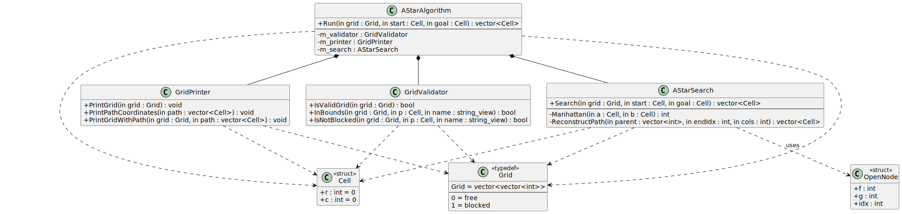
</p>

The updated UML class diagram shows how the project has been split from a single monolithic class into six separate components. There are four classes, one struct used as a type alias, and one plain struct. Below is a breakdown of each component and the relationships between them.


#### The Components
**`AStarAlgorithm`** sits at the top of the diagram and acts as the orchestrator for the entire pipeline. It has one public method, `Run()`, which takes a `Grid`, a start `Cell`, and a goal `Cell` and returns a `vector<Cell>` representing the found path. Its private section holds three member objects: `m_validator`, `m_printer`, and `m_search`. It owns these objects and delegates to each one at the appropriate step in `Run()`.

**`GridValidator`** sits in the middle row and is responsible solely for validation. It exposes three individual check methods: `IsValidGrid()`, `InBounds()`, and `IsNotBlocked()`, as well as a `ValidateCell()` method that runs all three in sequence. All methods are public and return `bool`. The `name` parameter on `InBounds()` and `IsNotBlocked()` is `string_view`, which is the C++17 replacement for `const char*`.

**`GridPrinter`** also sits in the middle row and is responsible solely for display. It has three public methods: `PrintGrid()` for rendering the raw grid, `PrintPathCoordinates()` for printing the path as a list of coordinates, and `PrintGridWithPath()` for overlaying the path visually on the grid using `*`.

**`AStarSearch`** sits in the middle row on the right and contains the pure pathfinding logic. It has one public method `Search()` which takes a `Grid`, start `Cell`, and goal `Cell` and returns the path. It also has two private helper methods: `Manhattan()` which calculates the heuristic distance between two cells, and `ReconstructPath()` which walks backwards through the parent array once the goal is reached to build the final path.

**`Cell`** is a struct in the bottom row. It holds two public integer fields, `r` and `c`, which represent a row and column coordinate on the grid. Both default to `0`. It is used throughout the project as the standard way to represent a position within the grid.

**`OpenNode`** is a struct in the bottom right. It holds three public integer fields: `f` (the total estimated cost `g + h`), `g` (the actual cost from start to this node), and `idx` (the flattened 1D index of the cell). It is used internally by `AStarSearch` to represent nodes stored in the priority queue.

**`Grid`** is a type alias in the bottom centre, marked with the `typedef` stereotype in the diagram. It is defined as `vector<vector<int>>` and the diagram also documents that `0` means free and `1` means blocked. Rather than a class or struct it is simply a named alias that makes all function signatures cleaner and easier to read.


#### The Relationships
**Composition arrows (solid line, filled diamond)**
There are three composition arrows pointing from `AStarAlgorithm` down to `GridValidator`, `GridPrinter`, and `AStarSearch`. Composition means `AStarAlgorithm` owns these objects. They are stored as member variables (`m_validator`, `m_printer`, `m_search`) and their lifetime is tied to the lifetime of `AStarAlgorithm`. If the `AStarAlgorithm` object is destroyed, so are all three of them. This is the strongest form of relationship in the diagram and reflects the fact that `AStarAlgorithm` is entirely responsible for coordinating these three subsystems.

**Dependency arrows (dashed line, open arrow)**
The dashed arrows represent dependency relationships, meaning one component uses another but does not own it. These are typically seen where a type appears as a function parameter or return type rather than as a stored member. The dependencies in the diagram are:

- `GridValidator` depends on both `Grid` and `Cell`: both types appear in its method signatures as parameters
- `GridPrinter` depends on both `Grid` and `Cell`: `Grid` is passed into `PrintGrid()` and `PrintGridWithPath()`, and `Cell` appears in `PrintPathCoordinates()` and `PrintGridWithPath()` via `vector<Cell>`
- `AStarSearch` depends on `Grid`, `Cell`, and `OpenNode`: `Grid` and `Cell` are parameters to `Search()`, and `OpenNode` is used internally within the search loop
- `AStarAlgorithm` depends on both `Grid` and `Cell`: both appear in the signature of `Run()`


#### What the Diagram Shows About the Design
The layout of the diagram communicates the architecture clearly. `AStarAlgorithm` sits at the top because it is the entry point and the only class a caller needs to interact with directly. The three subsystem classes sit in the middle because they each do one job and report upward to `AStarAlgorithm`. `Cell`, `Grid`, and `OpenNode` sit at the bottom because they are pure data types with no dependencies of their own, everything else depends on them, but they depend on nothing.

This follows the **Single Responsibility Principle**: each class in the middle row has exactly one reason to change. If the way errors are printed needs to change, only `GridValidator` is touched. If the visual output needs to change, only `GridPrinter` is touched. If the algorithm itself needs to change, only `AStarSearch` is touched. `AStarAlgorithm` only needs to change if the order or coordination of those steps changes.

### What was achieved in Week 4
- Refactored a single-class design into four focused classes following the **Single Responsibility Principle**
- Moved `Cell` into its own header so it has no dependency on algorithm code
- Introduced `using Grid = ...` to eliminate repeated complex type signatures across all files
- Replaced `const char*` with `std::string_view` in all validation interfaces (C++17)
- Added `PrintGridWithPath()` using `unordered_set` and the `contains()` member (C++20)
- Moved `OpenNode` to header scope with `operator>` for cleaner priority queue usage
- Replaced redundant validation guards inside `AStarSearch` with `assert` preconditions
- Used `std::ranges::reverse()` for idiomatic path reconstruction (C++20)
- Made `Run()` accept parameters instead of hardcoding the grid, making the class reusable

---

## Week 5

In week 5, I extended the project in three areas: separating all test scenarios into dedicated `TestAStarAlgorithm` files to keep `main.cpp` as lean as possible, introducing a `GridBuilder` class with multiple constructors to handle all grid construction and show off the use of constructors, and updating `GridPrinter` to mark the start and goal cells visually with `S` and `G` in all output. I also added `operator==` to `Cell`. This equality operator overload will be useful for comparing if a `Cell` is a start or goal cell in some test methods and will also show off more uses of operator overloading.

### `TestAStarAlgorithm.h` and `TestAStarAlgorithm.cpp`: Separating Test Scenarios
Previously, all scenario logic lived directly in `main.cpp`. The project brief requires `main` to be kept as empty as possible, so the scenarios have been moved into their own dedicated files.

`TestAStarAlgorithm.h` declares one entry point and a function for each individual scenario:

```cpp
void RunAllTests();

void TestManualWallsGrid();
void TestAutoGrid();
void TestBlockedGoal();
void TestUnreachableGoal();
```

`main.cpp` is now three meaningful lines:

```cpp
#include "TestAStarAlgorithm.h"

int main()
{
    RunAllTests();
    return 0;
}
```

This follows the **Single Responsibility Principle**, `main` is responsible only for starting the program, not for defining what the program does. Each individual scenario function in `TestAStarAlgorithm.cpp` is responsible for one test case. Adding a new scenario means adding one function in one file, with no changes to `main.cpp` at all.

### `GridBuilder`: Constructing Grids
Before this week, grids were defined as raw `Grid` literals in `main.cpp`. This worked for simple demos but did not scale. There was no way to generate grids programmatically, no single place responsible for constructing them, and no named concept of "a blocked goal grid" or "an unreachable grid". `GridBuilder` solves all of this.

The class has three constructors and two static member functions. Claude initally told me the static member functions were `static named constructors`. I didn't believe this as the methods were returning a `GridBuilder` onject and constructors typically do not have a return. This is the definition Claude initially gave me of the so-called `static named constructors`.

> These are implemented as **static named constructors** (sometimes called the Named Constructor Idiom). The reason for using this pattern rather than adding more regular constructors is readability, a plain `GridBuilder(4, 4)` tells the reader nothing, whereas `GridBuilder::BlockedGoal(4, 4)` is self-documenting. Both methods construct a private `GridBuilder` object internally and return it by value. No heap allocation or raw pointers are involved.

```cpp
GridBuilder GridBuilder::Unreachable(int rows, int cols)
{
  GridBuilder builder;
  builder.m_start = { 0, 0 };
  builder.m_goal = { rows - 1, cols - 1 };
  builder.InitEmpty(rows, cols);

  // Place a wall down column 1 to cut off the left side
  for (int r = 0; r < rows; ++r)
    builder.m_grid[r][1] = 1;

  return builder;
}
```

Once I challenged it on this it gave the correct understanding that these are in fact static member functions. The reason static is needed here is because the factory methods need to be called before an object exists, because their whole job is to create the object. If they were not static, you would need a `GridBuilder` instance to call them on.

> You are completely right to question that. They are not constructors -- they are static factory methods. A constructor by definition has no return type and is invoked automatically when an object is created. These methods have a return type (GridBuilder), are called explicitly by name, and return a fully constructed object. Calling them "named constructors" is a term sometimes used informally in C++ literature to describe this pattern, but that label is misleading and technically inaccurate, and I should not have used it without flagging that distinction.

#### Default Constructor

```cpp
GridBuilder();
...
GridBuilder builder;
```

Produces the original hardcoded 4x4 demo grid with `Start = (0,0)` and `Goal = (3,3)`. This means the original test case still works with no raw data in the calling code.

#### Manual Walls Constructor

```cpp
GridBuilder(int rows, int cols, Cell start, Cell goal, const std::vector<Cell>& walls);
...
GridBuilder builder(
    5, 5,
    Cell{ 0, 0 },
    Cell{ 4, 4 },
    { { 1, 1 }, { 1, 2 }, { 1, 3 }, { 3, 1 }, { 3, 2 }, { 3, 3 } }
);
```

Takes rows, cols, start, goal, and a list of wall `Cell` positions. The constructor protects against two error cases: walls that are out of bounds (silently skipped with a warning), and walls that overlap the start or goal (also skipped with a warning). This is where `operator==` on `Cell` is used. The check `wall == m_start || wall == m_goal` is a clean, readable expression that would have required a manual row and column comparison without it. The `= default` is C++20 shorthand that tells the compiler to generate the usual equality operator that compares each member. This allows me to compare two `Cell`s without having to write comparison logic.

#### Auto-Generated Walls Constructor

```cpp
GridBuilder(int rows, int cols, float wallDensity);
...
GridBuilder builder(8, 8, 0.3f);
```

Takes rows, cols, and a `float` wall density between `0.0` and `1.0`. This uses `std::mt19937` seeded by `std::random_device`, the correct modern C++ approach to random number generation, replacing the old `rand()` / `srand()` pattern. `std::uniform_real_distribution<float>` ensures each cell has an independent probability of being blocked equal to the density value. The start and goal are always kept clear. Wall density is clamped to a maximum of `0.9` using `std::clamp` (C++17) to prevent the generator from producing a grid that is impossible to solve.

```cpp
wallDensity = std::clamp(wallDensity, 0.0f, 0.9f);

std::random_device rd;
std::mt19937 rng{ rd() };
std::uniform_real_distribution dist{ 0.0f, 1.0f };
```

This follows:

* **P.5: Prefer compile-time checking to run-time checking**: the clamp enforces the constraint at the point of use rather than letting an invalid density silently produce a broken grid
* **SL.con.1: Prefer using STL containers**: `std::mt19937` and `std::uniform_real_distribution` are the STL's dedicated tools for this job

#### Static Factory Methods: `BlockedGoal` and `Unreachable`

Two static factory methods produce grids specifically designed to test the validation and no-path code paths:

```cpp
const GridBuilder builder = GridBuilder::BlockedGoal(4, 4);
const GridBuilder builder = GridBuilder::Unreachable(4, 4);
```

These are **static member functions**: they belong to the class itself rather than to any instance of it. This is important because their job is to create a `GridBuilder` object, so there is no existing instance to call them on. `static` makes them callable directly on the class via `GridBuilder::BlockedGoal(4, 4)` without a `GridBuilder` object already existing.

They are not constructors (as explained above). A constructor has no return type and is invoked automatically when an object is created. These functions have an explicit return type of `GridBuilder`, are called by name, construct a `GridBuilder` object internally, configure it, and return it by value. The reason to use static factory methods rather than adding more regular constructors is readability, a plain `GridBuilder(4, 4)` tells the reader nothing about what kind of grid is being built, whereas `GridBuilder::BlockedGoal(4, 4)` is self-documenting. A constructor cannot have a name beyond the class name itself, so this intent cannot be expressed any other way.

`BlockedGoal` sets the goal cell to `1` (wall) after building an otherwise open grid, deliberately triggering the validation failure path in `AStarAlgorithm::Run`:

```cpp
builder.m_grid[rows - 1][cols - 1] = 1;
```

`Unreachable` places a full column of walls at column 1, cutting the grid in two. The start is on the left side and the goal is on the right, so no path exists even though the goal cell itself is open:

```cpp
for (int r = 0; r < rows; ++r)
    builder.m_grid[r][1] = 1;
```

Both scenarios were previously hardcoded directly in `TestAStarAlgorithm.cpp`. Moving them into `GridBuilder` means the construction logic and its intent are in one place, and the test functions are reduced to a single readable line each.

### `GridPrinter`: `S` and `G` Markers

`PrintGrid` and `PrintGridWithPath` both now take `Cell start` and `Cell goal` as parameters and render those positions as `S` and `G` respectively. Previously, the grid was printed as a plain pattern of `.` and `#` with no visual indication of where the algorithm was actually starting or heading.

```cpp
void PrintGrid(const Grid& grid, Cell start, Cell goal) const;
void PrintGridWithPath(const Grid& grid, const std::vector& path, Cell start, Cell goal) const;
```

Inside each function, the check runs before the wall/open check:

```cpp
if (current == start)
    std::cout << "S ";
else if (current == goal)
    std::cout << "G ";
else if (onPath)
    std::cout << "* ";
else
    std::cout << (grid[r][c] == 0 ? '.' : '#') << ' ';
```

The priority order matters: `S` and `G` are always rendered regardless of whether they happen to also be on the path, which ensures the start and goal are always clearly visible in both the initial grid and the path overlay. The result looks like this:

```
Grid:
S . . .
. # . #
. . # #
# . . G

Grid with path ('*'):
S . . .
* # . #
* * # #
# * * G
```

This change also required updating `AStarAlgorithm::Run()` to forward `start` and `goal` through to both printer calls.

### `Cell`: `operator==` Added

```cpp
bool operator==(const Cell&) const = default;
```

The defaulted equality operator was added to `Cell`. It has two uses: the wall overlap check in `GridBuilder`'s manual walls constructor, and the `S`/`G` rendering logic inside `GridPrinter`. Using `= default` instructs the compiler to generate the comparison from the member fields automatically, equivalent to `return r == other.r && c == other.c`, following:

* **C.80: Use `= default` if you have to be explicit about using the default semantics**: the compiler-generated version is correct and there is no reason to write it manually

### `Search()` Method Analysis

The `Search()` method is a very long method that breaks the modern C++ **Single Responsibility Principle (SRP)**. The function is long because it is doing several distinct things inline such as:
- Initialising data structures.
- Running the main loop.
- Processing neighbours.
- Reconstructing the path.

These all violate `SRP` at the function level, not just the class level. There is a good reason why the `Search()` method is so long. A* is an inherently stateful algorithm. The `bestG`, `parent`, `closed`, and `open` structures all need to talk to each other throughout the search. This makes it harder to decompose than something like validation or printing, because I cannot cleanly pass all that shared state between small functions without either a lot of parameters or making them member variables. 

#### Claude Suggestions

When I asked Claude about solutions to fix the length of the `search()` method, it gave me some options and suggestions:

**Option 1: Extract a private helper for neighbour processing**

The inner `for` loop that processes neighbours is a self-contained unit of work. It could become a private method.
```cpp
void ProcessNeighbour(const Cell& neighbour, int currentIdx,
                      const Grid& grid, Cell goal,
                      std::vector<int>& bestG,
                      std::vector<int>& parent,
                      std::priority_queue<...>& open) const;
```

This has its own problems though. I would end up passing several parameters just to avoid a `for` loop being in `Search()`. 

**Option 2: Extract a private search context struct**

Claude also suggested that a cleaner modern C++ approach is to bundle the algorithm's working state into a private struct, which `Search()` constructs and then delegates to:
```cpp
struct SearchContext
{
    const Grid&            grid;
    const int              rows;
    const int              cols;
    const int              goalIdx;
    std::vector<int>       bestG;
    std::vector<int>       parent;
    std::vector<bool>      closed;
    std::priority_queue<OpenNode,
        std::vector<OpenNode>,
        std::greater<OpenNode>> open;

    void ProcessNeighbours(const OpenNode& current);
    std::vector<Cell> Run(Cell start, Cell goal);
};
```

`Search()` would then become:
```cpp
std::vector<Cell> AStarSearch::Search(const Grid& grid, Cell start, Cell goal) const
{
    SearchContext ctx{ grid, start, goal };
    return ctx.Run();
}
```

This is a much cleaner and more modern approach, but it is significantly more complex to implement and it is probably over-engineering for what is still fundamentaly one algorithm. It would be worth doing if `Search()` was being called from multiple places or if the context needed to be inspected after the search completed.

**The Honest Answer from Claude**

Claude gave me a rather honest answer about my questions with `Search`. Here is the full context response it gave me:
> The honest answer for your project:
The length of Search is a known limitation worth acknowledging in your blog rather than something that needs to be fixed right now. The C++ Core Guidelines themselves note that some algorithms are inherently procedural and that forcing them into small functions can reduce clarity rather than improve it. What makes your current version acceptable is that it is well commented, the variable names are descriptive, and the logical sections are visually separated. A long function with clear structure is better than several short functions with unclear relationships.

It shows that even though `Search()` breaks *some* modern C++ practices, it is also important to think about making sure procedural algorithms have enough clarity so people can understand the code. Since `Search()` is well commented, the variable names make sense, and sections are split up based on what logic they implement, it is perfectly acceptable to keep it as a long function.

### A General Code review

Beyond the specific class-level changes made each week, there are a number of smaller but important keywords and standard library tools used consistently throughout the codebase. This section looks at those in detail.

#### `const`

`const` appears in two distinct contexts in the project.

**`const` on method declarations**

Every method across `GridValidator`, `GridPrinter`, and `AStarSearch` is marked `const`:

```cpp
bool IsValidGrid(const Grid& grid) const;
std::vector Search(const Grid& grid, Cell start, Cell goal) const;
int Manhattan(Cell a, Cell b) const noexcept;
```

The `const` after the parameter list means the method promises not to modify any member variables of the class. None of these methods have any reason to change the state of the object they are called on, `GridValidator` only reads the grid, `AStarSearch` only reads and returns a path. Marking them `const` is the honest declaration of that fact. It also means these methods can be called on `const` instances of the class, which is good practice to follow:

- **Con.2: By default, make member functions `const`**

**`const` on local variables**

Inside `Search()`, almost every local variable is declared `const`:

```cpp
const int rows = static_cast(grid.size());
const int cols = static_cast(grid[0].size());
const int startIdx = toIndex(start);
const OpenNode current = open.top();
const Cell curCell = toCell(current.idx);
const int tentativeG = bestG[current.idx] + kMoveCost;
```

Once `rows`, `cols`, or `startIdx` are calculated, they never change. Declaring them `const` makes that explicit. If I accidentally tried to reassign one of these the compiler would catch it immediately. It also makes the code easier to read, any variable without `const` is one that is expected to change, so `bestG`, `parent`, and `closed` standing out as non-`const` immediately signals that they are the mutable state of the algorithm.

#### `constexpr`

`constexpr` goes one step further than `const`. Where `const` means a value will not change at runtime, `constexpr` means the value is known and fixed at **compile time**. The compiler can substitute the value directly wherever it is used, with no runtime cost at all.

In `Search()` there are three `constexpr` declarations:

```cpp
constexpr int kMoveCost = 1;
constexpr int dr[4] = { -1,  1,  0,  0 };
constexpr int dc[4] = {  0,  0, -1,  1 };
```

`kMoveCost` is always `1`: the cost of moving from one cell to any adjacent cell never changes regardless of which grid is passed in. The direction arrays `dr` and `dc` are fixed representations of up, down, left, and right. They are the same for every run of the program. There is no reason for these to exist as runtime variables.

Using `constexpr` here follows:

- **P.5: Prefer compile-time checking to run-time checking**: if something can be known at compile time, it should be expressed that way
- **Con.5: Use `constexpr` for values that can be computed at compile time**

#### `std::numeric_limits<int>::max()`

```cpp
const int INF = std::numeric_limits::max();
```

`INF` is used to initialise `bestG`, the array that tracks the best known cost to reach each node. Every node starts at `INF` meaning "not yet reached". As the algorithm finds paths, those values get updated to real costs.

The reason I use `std::numeric_limits<int>::max()` rather than just writing a large number like `99999` is correctness and portability. `std::numeric_limits<int>::max()` is the actual largest value an `int` can hold on whatever system the code runs on. A hardcoded large number might seem safe but could be exceeded on certain grids or cause silent bugs. `std::numeric_limits` is the standard library's way of expressing type boundaries without guessing.

It comes from `<limits>`, which is included at the top of `AStarSearch.cpp`:

```cpp
#include 
```

#### `<cassert>` and `assert()`

```cpp
#include 

assert(!grid.empty() && !grid[0].empty() && "Search called with empty grid");
assert(grid[start.r][start.c] == 0 && "Start cell is blocked");
```

`<cassert>` provides the `assert()` macro. An assertion is a check that is expected to always be true. If it is false, the program immediately stops with a message pointing to the exact line that failed. This is a debugging tool, assertions are compiled away entirely in release builds when `NDEBUG` is defined, so they add zero overhead in production.

The reason I used `assert` here rather than `if`/`return` guards is that `AStarAlgorithm::Run()` already validates all inputs before calling `Search()`. By the time `Search()` is called, the grid and cells have already been checked. The `assert`s are not defensive runtime checks, they are a contract: "if you are calling this function, these conditions must already be true. If they are not, something has gone wrong in the calling code."

#### `<unordered_set>` in `GridPrinter`

```cpp
#include 

std::unordered_set pathSet;
pathSet.reserve(path.size());
for (const auto& p : path)
    pathSet.insert(p.r * cols + p.c);
```

I used `std::unordered_set` in `PrintGridWithPath()` to build a fast lookup of which cells are on the path. The alternative would be to check if each grid cell appears in the `path` vector using a linear scan, which gets slower the longer the path is. `unordered_set` gives O(1) average lookup per cell regardless of how many cells are in it.

The `reserve()` call pre-allocates enough space for exactly as many entries as there are path cells. Without it, the set would resize itself internally as entries are inserted. Pre-allocating avoids that overhead.

To check if a cell is on the path, I use `contains()`:

```cpp
const bool onPath = pathSet.contains(r * cols + c);
```

`contains()` was introduced in **C++20** as a cleaner alternative to the older pattern of `find() != end()`. Both do the same thing but `contains()` reads as plain English.

---

## Wrap-up & Demo

By the end of the project, the A* algorithm is fully implemented and running across five test scenarios. The codebase has grown from a single monolithic class into a modular, multi-file project that follows modern C++ practices and the C++ Core Guidelines throughout. Below is a walkthrough of the full flow from entry point to output, followed by the five scenarios in action.

### How the Program Flows
 
Everything starts in `main.cpp`, which I deliberately kept as empty as possible:
 
```cpp
#include "TestAStarAlgorithm.h"
 
int main()
{
    RunAllTests();
    return 0;
}
```
 
`RunAllTests()` lives in `TestAStarAlgorithm.cpp` and calls each scenario in sequence. Each scenario follows the same three-step pattern: build a grid using `GridBuilder`, create an `AStarAlgorithm` object, and call `Run()`:
 
```cpp
const GridBuilder builder;
AStarAlgorithm aStar;
aStar.Run(builder.GetGrid(), builder.GetStart(), builder.GetGoal());
```
 
Inside `AStarAlgorithm::Run()`, the work is delegated to the three subsystems in order:
 
```cpp
// 1. Validate
if (!m_validator.IsValidGrid(grid)) return {};
if (!m_validator.ValidateCell(grid, start, "Start")) return {};
if (!m_validator.ValidateCell(grid, goal, "Goal")) return {};
 
// 2. Print the grid
m_printer.PrintGrid(grid, start, goal);
 
// 3. Search
const auto path = m_search.Search(grid, start, goal);
 
// 4. Print the result
m_printer.PrintPathCoordinates(path);
m_printer.PrintGridWithPath(grid, path, start, goal);
```
 
`AStarAlgorithm` itself does not know how any of these steps work internally. It only knows what order to call them in. The actual validation logic is in `GridValidator`, the display logic is in `GridPrinter`, and the pathfinding is in `AStarSearch`. This is the Single Responsibility Principle working in practice.
 
Inside `AStarSearch::Search()`, the algorithm maintains three vectors to track state across the search:
 
```cpp
std::vector<int>  bestG(total, INF);    // best cost to reach each node
std::vector<int>  parent(total, -1);    // where each node was reached from
std::vector<bool> closed(total, false); // whether a node has been fully processed
```
 
Nodes are explored in order of lowest `f = g + h` using a min-heap priority queue. When the goal is reached, `ReconstructPath()` walks the `parent` array backwards from goal to start and reverses it to produce the final path.

### Test Scenarios
 
#### Scenario 1: Default Grid
 
The default `GridBuilder` constructor produces the original hardcoded 4x4 demo grid. `S` marks the start at `(0,0)` and `G` marks the goal at `(3,3)`. 
```cpp
GridBuilder::GridBuilder() : m_start{ 0, 0 } , m_goal{ 3, 3 }
{
  m_grid = {
      { 0, 0, 0, 0 },
      { 0, 1, 0, 1 },
      { 0, 0, 1, 1 },
      { 1, 0, 0, 0 }
  };
}
```

`m_start` and `m_goal` are passed as a `member initialiser list`. Instead of assigning values to member values inside the actual constructor, I initialise them directly before the body runs. This is the prefered method of assigning values in constuctors in modern C++. With a `member initialiser list`, the members are constructed with the correct values in a single step whereas if I was to assign them inside the body, I would be default constructing them and then immediately overwriting them (a two step process). I assign all constructor values like this.

**Default Test Case**

```cpp
void TestDefaultGrid()
{
  std::cout << "=== Scenario 1: Default grid ===\n\n";

  const GridBuilder builder;
  AStarAlgorithm aStar;
  aStar.Run(builder.GetGrid(), builder.GetStart(), builder.GetGoal());

  std::cout << '\n';
}
```

 **Default Test Result**
 
<p align="center">
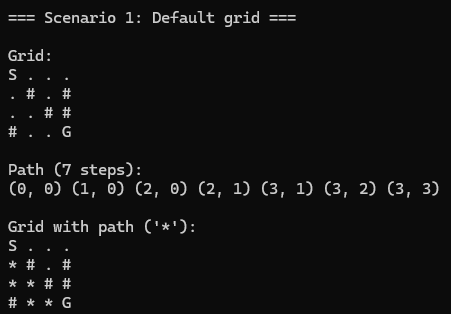
</p>

#### Scenario 2: Manual Walls Grid
 
A 5x5 grid with two rows of walls placed manually. The algorithm navigates down the left side and along the bottom to reach the goal.

**Manual Walls Test Case**

```cpp
void TestManualWallsGrid()
{
  std::cout << "=== Scenario 2: Manual walls grid ===\n\n";

  const GridBuilder builder(5, 5, Cell{ 0, 0 }, Cell{ 4, 4 },
                            {    // walls 
                                { 1, 1 }, { 1, 2 }, { 1, 3 },
                                { 2, 1 }, { 2, 2 }, { 2, 3 },
                            }
  );

  AStarAlgorithm aStar;
  aStar.Run(builder.GetGrid(), builder.GetStart(), builder.GetGoal());

  std::cout << '\n';
}
```

**Manual Walls Test Results**
 
<p align="center">
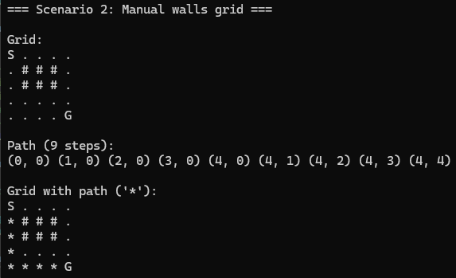
</p>

#### Scenario 3: Auto-Generated Walls
 
An 8x8 grid with approximately 30% (`0.3f`) of cells blocked randomly using `std::mt19937`. `std::mt19937` is a Mersenne Twister random number generator from the C++ standard library `<random>`. This is the modern C++ approach for random number generation compared to the C-style `rand()` function which has poor quality randomness and it is not thread safe as it relies on a global sate. The start and goal are always kept clear. The path changes on every run.

**Auto-generated Walls Test Case**

```cpp
void TestAutoGrid()
{
  std::cout << "=== Scenario 3: Auto-generated walls (8x8, 30% density) ===\n\n";

  const GridBuilder builder(8, 8, 0.3f);

  AStarAlgorithm aStar;
  aStar.Run(builder.GetGrid(), builder.GetStart(), builder.GetGoal());

  std::cout << '\n';
}
```

**Auto-generated Walls Test Results**
 
<p align="center">
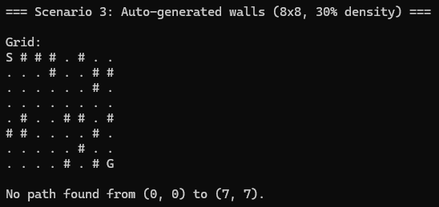
</p>

Scenario 3 does not always return a successful path because of the randomness of the cell blocks but if I re-run the program, I can get successful paths.

<p align="center">
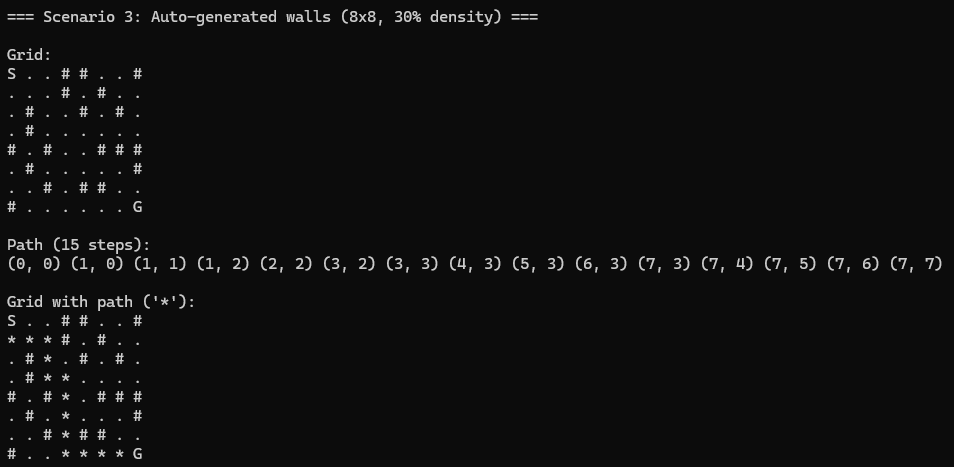
</p>
 
#### Scenario 4: Blocked Goal
 
`GridBuilder::BlockedGoal` sets the goal cell to a wall. `GridValidator` catches this before the search even starts.
 
```
Error: Goal cell (3, 3) is blocked.
```

**Blocked Goal Test Case**

```cpp
void TestBlockedGoal()
{
  std::cout << "=== Scenario 4: Blocked goal ===\n\n";

  const GridBuilder builder = GridBuilder::BlockedGoal(4, 4);

  AStarAlgorithm aStar;
  aStar.Run(builder.GetGrid(), builder.GetStart(), builder.GetGoal());

  std::cout << '\n';
}
```

**Blocked Goal Test Result**
 
<p align="center">
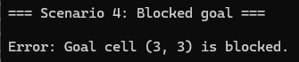
</p>

#### Scenario 5: Unreachable Goal
 
`GridBuilder::Unreachable` places a full wall column at column 1, cutting the grid in two. The goal is valid but no path exists.
 
```
No path found from (0, 0) to (3, 3).
```

**Unreachable Goal Test Case**

```cpp
void TestUnreachableGoal()
{
  std::cout << "=== Scenario 5: Unreachable goal ===\n\n";

  const GridBuilder builder = GridBuilder::Unreachable(4, 4);

  AStarAlgorithm aStar;
  aStar.Run(builder.GetGrid(), builder.GetStart(), builder.GetGoal());

  std::cout << '\n';
}
```

**Unreachable Goal Test Result**
 
<p align="center">
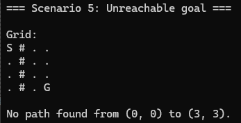
</p>

## Limitations Encountered

Looking back at the whole project development cycle there was a few issues or limitations I encountered. 

### `Search()` is too long

This is the most obvious one. The function handles data structure initialisation, the main loop, neighbour processing, and path reconstruction all in one place. That breaks the **Single Responsibility Principle** at the function level, which is something I applied carefully at the class level throughout the refactor but did not fully address inside `Search()` itself. The proper fix would be a `SearchContext` struct that bundles the algorithm's working state and exposes smaller methods (as Claude outlined to me earlier), but implementing that cleanly is significantly more complex and I made the call that it was not worth the added complexity for this module. The function is well commented and logically structured, which makes it acceptable as it stands, but it is something I am aware of.

### Only Manhattan distance is Supported

The heuristic is hardcoded as Manhattan distance, which works correctly for 4-direction grids. If I wanted to support diagonal movement the heuristic would need to change to Euclidean distance, and that would require changes in multiple places. A better design would make the heuristic a parameter, either as a `std::function` or a template, so the search could be configured without modifying the class itself. I initially thought about implementing diagonal movement at the start of the project but I decided to stick with 4-directional movement as it was easier to understand and explain and also allowed me to focus more on following modern C++ practices and understanding the A* algorithm.

### Claude initially gave me redundant code that I removed which later became useful

The `operator==` on `Cell` is a good example of this. When Claude first suggested it during the Week 4 refactor, I removed it because at that point nothing in the codebase was actually comparing two `Cell` values directly. Claude never flagged that it would become useful later. It was only when I introduced `GridBuilder` in Week 5, specifically the manual walls constructor that needed to check whether a wall position overlapped the start or goal, that I needed it. If I had been more forward-thinking about where the project was heading I might have kept it from the start. The lesson is that AI tools generate code for the current state of the project, not for where it is going. It also shows the importance of analysing AI code to make sure it is doing what you actually want it to do.

## Project Management

The project was managed week by week, using the lab session checkpoints with Michelle to assess progress and decide what to focus on next. Each week I updated my github pages blog with changes That I had made and each week had a clear goal:
 
- **Week 1**: get an initial project structure set up and display a basic grid.
- **Week 2**: design the class structure using UML before writing more code.
- **Week 3**: implement validation, the Manhattan distance calculation, and the full A* search.
- **Week 4**: refactor everything into a proper modular OO design using Claude.
- **Week 5**: extend with `GridBuilder`, test scenarios, visual improvements, and a final UML class diagram.
 
This kind of iterative approach worked well for me. Getting a working implementation first in Week 3 and then refactoring in Week 4 was the right call for me. Getting the actual algorithm working first helped me to understand the whole concept of it and how the algorithm worked internally.. Having it working first meant the Week 4 refactor was about improving structure I already understood, not about figuring out the algorithm at the same time.
 
I Documented progress weekly in the README as I went so I did not have to reconstruct what I did or why at the end, I wrote down what I did and the end of each week so I wouldn't forget the technical aspects of what I worked on. That was probably the most useful habit of the project.
 
Where I could have managed things better is in planning further ahead. Some decisions I made early, like removing `operator==` from `Cell`, had to be revisited later. A bit more thought at the start about where the project was heading might have avoided a few of those backwards steps. That said, for a project that evolved as much as this one did across the weeks, some of that was inevitable.

## Reflection

Looking back at where this project started, a single `AStarAlgorithm` class doing everything in one file, and where it ended up, the improvement is pretty clear. The final codebase has nine files, four focused classes, a clean entry point, and five distinct test scenarios. More importantly, I understand why each of those things exists. I make use of concepts such as `const`, `constructors`, and `operator overloading` that we learned throughout the module by implementing them into the A* algorithm and identifying why they were being used by AI code.
 
The biggest learning for me was the refactor in Week 4. Before that, I knew what the code was doing but I had not thought carefully about how it was structured. Going through the process of splitting `GridValidator`, `GridPrinter`, `AStarSearch`, and `AStarAlgorithm` into separate responsibilities forced me to think about what each piece of code actually owns and why. That way of thinking carries forward to any future project.
 
Using Claude throughout the project was genuinely useful but required more critical engagement than I expected. It was not a case of asking a question and copying the answer. The `static named constructors` example is the clearest illustration of that. Claude gave me a label that sounded correct but was technically wrong, and it took my own understanding of what a constructor actually is to catch it. The same applies to the `operator==` situation, where Claude generated code I removed because I did not see a use for it, and it only became useful later. AI tools are good at generating code that follows patterns, but they do not always think ahead about how a project will evolve. That judgement still has to come from me.
 
What I would do differently is introduce `GridBuilder` earlier. In Week 3 and much of Week 4, grids were defined as raw literals wherever they were needed. Having a dedicated class for grid construction from the start would have made the test scenarios cleaner from the beginning and avoided the raw data sitting in `main.cpp` for as long as it did.
 
Overall this was a worthwhile project. A* is a more involved algorithm than it looks from the outside, and getting it working correctly, understanding each part of it, and then building a clean structure around it gave me a much better sense of what modern C++ design actually looks like in practice.
